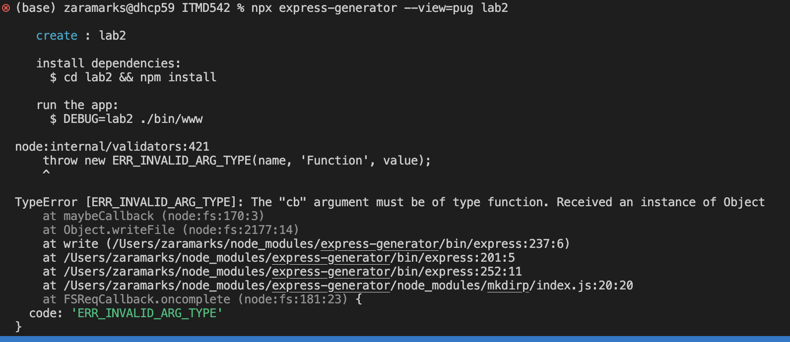

# Introduction

Name : Zara Marks

Email: zmarks1@hawk.iit.edu

# Project Description 

# Development Environment 

Node JS Version : 16.17.0 

# Installation/Running Instructions 

## Step 1 - Install Node

If you are a MAC user like, install Node using the command line : 

`brew install node`

If it is intalled, you can test using :

`node -v`

## Step 2 - Create or clone to project

Here you will have two options, you can either clone a repository or create a new project. I will give instructions for both

### Create 

Go to the folder you wish to create your project

To install Express, run the command line : 

`npm install express` 

To install Express Generator:

`npm install express-generator@latest`

Create your project and move to inside the project:
``` 
npx express-generator --view=pug myapp
cd myapp
```

### Clone this project

Go to the folder you wish to clone this project and run the following command:

`git clone git@github.com:zaramarks1/ITMD542.git`

Also this is lab 2, so go to lab 2 :

`cd ITMD542/lab2`

### For both

Since we are inside the folder with the project:

Lets also download npm-check-updates so we can see if we need to have any updates:

` npm install npm-check-updates@latest `

This will check if theres any thing to update:

`npx npm-check-updates`

If there is, you can run the following command:

`npm install`

And now we can start our project using :
s
`npm start`

If you go to **http://localhost:3000/** you should be seing node express welcome page or the contact page.


# Insights and Results

## Problems
 1. Installation :
    * I had some problems with the version of  some dependencies so I kept getting critical vulnerabilities, solved with (`npm audit fix --force) 
    * When I ran the express-generator there was an error while creating the project (But solved updating some dependencies and changing the name of the project to myapp):

    

    

# References (if needed) 